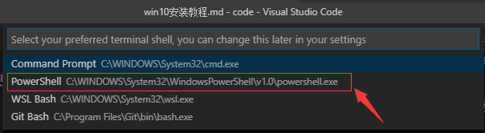

# Win10 安装教程

## 0. 下载 Python 安装包

Python 软件下载页面在： **注意这里是 Python 3.7.4**

[官网下载地址](https://www.python.org/downloads/release/python-374/)

打开页面点击对应的安装包下载即可：

由于该网址在境外，如果遇到下载速度比较慢的问题，也可以直接点击这里下载：

[点击下载 x64](../files/python-3.7.4-amd64.exe)

[点击下载 x86](../files/python-3.7.4.exe)

## 1. 安装 Python

Windows 下的 Python 安装比较简单，下载完成后基本上一路 NEXT 即可，不过需要注意的一点是，在刚打开安装页面的时候，需要勾选 Add Python 3.7 To PATH。

勾选后点击 Install Now 即可开始安装。

## 2. 下载并安装 VS Code

VS Code 是一款代码编辑器，可以理解成是一个功能十分强大的记事本，我们需要用到里面的 Terminal（终端） 来执行我们的代码。当然了， VS Code 目前其实已经强大到能 运行、调试 Python 代码了，这里暂时不介绍如何调试 Python 代码，仅仅实现最基础的执行的功能。

这里是 VS Code 的官网安装地址：

[官网下载地址](https://code.visualstudio.com/)

同样的，由于下载地址在境外，所以提供一个安装地址：

[点击下载 x64](../files/VSCodeUserSetup-x64-1.38.1.exe)

VS Code 的安装跟普通软件的安装基本无差，一路 Next 和 Install 即可。

## 3. 验证 Python 和 VS Code 安装成功

1. 同时按 Ctrl 和 ` 键，调出终端
2. 检查左下角的终端类型

比较推荐的是 wsl, bash 和 PowerShell，如果不是，需要按照以下方式修改：

3. 在终端里面输入 `python`，如果出现

代表已经安装完成，[点击这里](../README.md)返回目录~

如果出现

一般都是因为没有将 Python 添加到 PATH 中去，请自行度娘 `"Windows 添加 Python PATH"` 或者点击这个 [解决办法](https://www.jb51.net/article/140028.htm)
