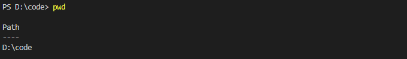
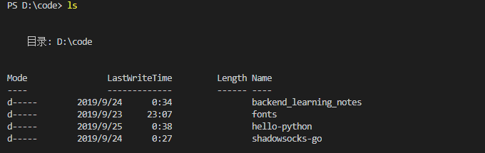
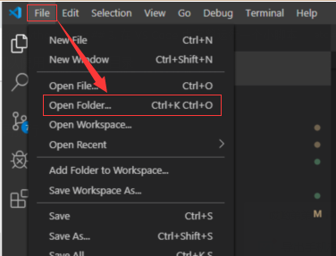
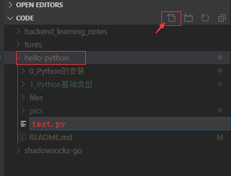
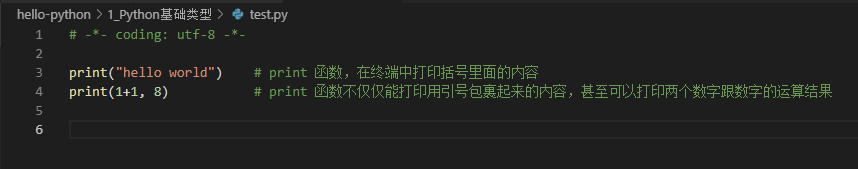

# 运行 Python

## 1. 什么是 Terminal

Terminal 我们一般称之为终端，不像 QQ 这种用鼠标交互的软件， Terminal 一般都只会用到键盘。一般常见的终端有 cmd，PowerShell，shell 等，由于我们在 Windows 平台下开发的同学会比较多，微软后推出的，功能会更完善的 PowerShell 是比较推荐来运行 Python 的工具。

Terminal 最明显的特征是黑框框，在黑框框里面输入的内容，我们一般称为 命令。一般而言，命令用 `空格` 作为分隔符，比如下面的命令：

```sh
python test.py user
```

其中 `python` 是代表安装在电脑系统里面的 Python 软件， `test.py` 是传给 python 软件的 第一个参数， `user` 是传给 python 软件的第二个参数。上面这一行在 Terminal 中输入的命令总结起来做的事情就是：

```
调用 Python 软件 执行 test.py 这个脚本，同时传入 user 这个参数给 这个脚本。
```

## 2. 命令行代码需要注意什么？

### 2.1 空格

一定不能忘记空格的存在，这是命令行用来分割命令的标志符号，如果忘记一个或者在不该传的地方传入了，程序就会执行失败。错误示例：

```sh
python test.pyuser
python test. py user
```

### 2.2 路径

执行对应的 `.py` 文件的时候，当前终端所在的位置必须是要在指定文件的目录下。可以通过 pwd 命令查看当前路径，可以通过 ls 命令查看当前目录是否有想要执行的脚本文件。

pwd



ls



如果执行 ls 发现目标脚本文件不在当前目录， 可以使用 cd 来切换目录


在确定 xxx.py 文件确实处于当前目录的情况下，再执行

```sh
python xxx.py
```

### 2.3 自动补全

由于路径或者文件名有些可能有些复杂，可以通过输入头几个字母后 按 `TAB` 键来自动填充，达到快速补齐的效果。

## 3. 在 VS Code 中完整运行一个小脚本

### 3.0 用 vscode 打开一个文件夹



### 3.1 创建一个 .py 后缀的文件



### 3.2 写入代码



代码部分：

```py
# -*- coding: utf-8 -*-

print("hello world")    # print 函数，在终端中打印括号里面的内容
print(1+1, 8)           # print 函数不仅仅能打印用引号包裹起来的内容，甚至可以打印两个数字跟数字的运算结果
```

### 3.3 在终端中执行

切换到 test.py 所在的路径，执行

```
python test.py
```

就会看到以下结果


发现和括号里面包含的内容是一样的。

至此，你已经安装完成环境以及会执行简单的 Python 代码啦，[点击这里](../README.md#2-Python-是怎么表达数据的) 返回最开始的页面~
